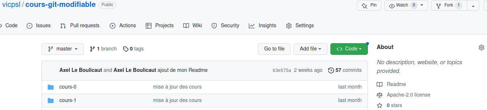
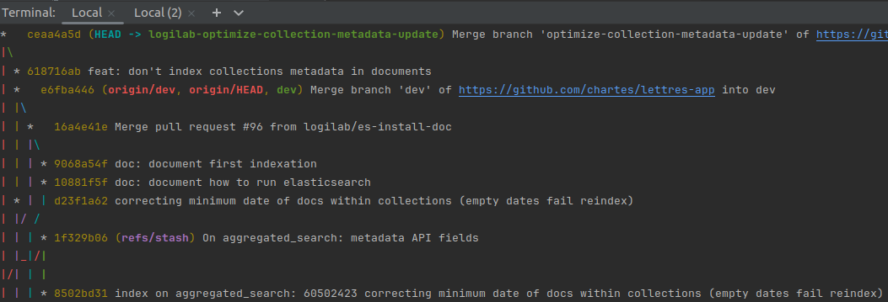

# 1. Commandes de bases de manipulation de dossiers / fichiers :

- **Créer un dossier / répertoire** : `mkdir [nom du dossier]`
- **Lire un répertoire** : `ls -la` (-la pour lister également les fichiers cachés .git / .gitignore)
- **Se déplacer dans un dossier** : `cd [adresse du dossier]` (Ex. `cd child` si l'on souhaite accéder au dossier 'child' du dossier parent où l'on se situe actuellement)
- **Créer / éditer un fichier** : `touch [nom du fichier]` (créer un fichier vide sans ouvrir d'éditeur)
- **Créer / modifier un fichier** : `nano [nom du fichier]` (ctrl+x pour quitter, sauvegarder avec O ou Y selon la langue + Enter)
- **Ouvrir un fichier dans son éditeur système par défaut** : `gedit [nom du fichier]`

Suppression : attention à la suppression récursive du type rm -r ou tous les dossiers / fichiers enfants sont supprimés
- **Supprimer un fichier** : `rm [nom du fichier]`
- **Supprimer un dossier** : **/!\\** `rm [nom du dossier] -r`

# 2. Commandes de base Git

- **Initialisation** : `git init`
- **Ajout de modifications** : `git add [Nom du fichier]` ou `git add -A` (Ajout de tous les fichiers changés)
- **État du dépôt** : `git status` (donne la liste des modifications réalisées et de leur état)
- **Enregistrement de modifications** : `git commit -m "Message du commit"`. N'oubliez jamais le -m à moins de vouloir passer un mauvais moment.
- **Historique du repository** : `git log`
- **Différence entre l'état archivé et l'état actuel** : `git diff` pour une différence détaillée, `git status` pour un point général.

- `git branch -a` : lister toutes les branches
- **Créer une branche** : `git branch [nom de la branche]`
- **Se déplacer dans une branche** : `git checkout [nom de la branche]`
- **Créer et se déplacer sur une nouvelle branche en même temps** : `git checkout -b [nom de la branche]`
- **Fusionner une branche** : `git merge [branche dont on veut les modifications]` (on fusionne généralement depuis la branche réceptrice, celle sur laquelle on veut continuer de travailler ensuite)

# 3. Créer un dépôt Github à partir d'un dépôt local

Documentation Github en ligne https://docs.github.com/en/get-started et https://docs.github.com/fr/get-started en Français.

1. Sur Github, créer un repo "notes-de-cours" (qui recevra notre dépôt local)
	- **/!\\ Surtout ne pas cocher initialiser le repository**
		- Pourquoi ?
2. Créer et initialiser un dépôt local "notes-de-cours" correspondant  
*En général un dossier/dépôt local avec du code existe déjà*
3. Ajouter le serveur Github à votre dépôt local
	- `git remote add origin [adresse du serveur distant GitHub]`
4. Pour le premier push de synchronisation
	- `git push -u origin master`
		- envoie (*push*) ma branche actuelle (*master* ou main) sur la branche *master* (ou main) du serveur Github, par convention *origin*. Cette branche correspondra à partir de maintenant à celle sur mon dépôt local
        - "-u:" le flag *-u* signifie "upstream", équivalent à '-set-upstream'
	- `git push` sera suffisant (pour la branche master !) à partir de maintenant.
    - Toute *nouvelle_branche* locale nécessitera `git push -u origin nouvelle_branche`

# 4. Cloner un dépôt :
Copie locale sans possibilité de mise à jour du dépôt distant si l'on ne dispose pas des droits.

- Se rendre sur le dépôt :

> [https://github.com/vicpsl/cours-git](https://github.com/vicpsl/cours-git)

- Copier son URL (mode https) :

- Dans le terminal du dossier d'accueil du dépôt local :

`git clone https://github.com/vicpsl/cours-git.git`

# 5. Réaliser un **fork** (droits de modification) :
Copie distante (et donc locale via un clone) avec possibilité de mise à jour de notre dépôt distant.

# 6. Commandes utiles (statut et intéractions distant / local)

- `git remote -v` : répertorie vos connexions distantes avec d'autres dépôts, incluant leurs URLs
- `git remote show origin` ou `git remote show upstream` : sortie détaillée d'un dépôt distant, dont la liste des branches associées au dépôt distant et celles en local liées pour les pull et les push
- `git branch -r` : listes toutes les branches du dépôt distant
- `git branch -a` : lister toutes les branches
- `git pull` : mettre à jour immédiatement *la branche courante* du dépôt local (combinaison de git fetch et git merge)
- `git pull --all` : **/!\\** mettre à jour immédiatement *toutes les branches liées* du dépôt local
- `git push -u origin [nom branche distante]` (voir 3) : **premier** push de synchronisation d'une branche locale vers le dépôt distant
- `git push` (voir 3) : push de synchronisation d'une branche locale vers le dépôt distant
- `git fetch --all -p`: mets à jour les références locales vers les branches distantes (ex: si une branche distante a été supprimée, la commande va supprimer cette référence localement) sans toucher la branche locale

# 7. **Pulls Requests** : mise à jour d'un dépôt distant entre branches1 ou entre un original (*upstream*) et son fork : 
1 Comme un "merge" entre branches locales mais sur le dépôt distant.

A réaliser sur Github directement :
NB : lorsqu'une mise à jour a été soumise, des pull-requests sont créées (onglet **Pull requests**).  
On peut également en créer directement sur Github (**New pull request**).

1. Vérifier le code dans la liste des commits et/ou dans l'onglet Files Changed
2. Tester en local (créer une branche test et y charger le code de la PR avec git pull)
3. Mettre à jour la PR (accepter : merge, commenter : demande d'ajustement ou fermer : close)

# 8. Autres commandes intéressantes (à manier avec précaution) :

Lorsque l'on effectue des mises à jour sur une branche, il se peut que nous ayons besoin de changer de branche pour aller vérifier un point.
Or Git ne vous autorisera pas à *checkout* vers une autre branche si vos changements ne sont pas enregistrés (git add et commit -m).
Si nos mises à jour ne sont pas achevées ou complètes, on peut les mettre de côté temporairement :
- **Mettre de côté sans faire git add / git commit -m** : `git stash`
- **Recharger les changements mis de côté** : `git stash pop`

Suppression d'une branche :
Git ne vous autorisera pas à supprimer la branche sur laquelle vous êtes, il faut se déplacer sur une autre (en général la branche principale de travail : dev ou master/main)  
- **Supprimer localement** : `git branch -d [nom branche locale]`
- **Supprimer dépôt distant** : `git push origin --delete [nom branche distante]`
- **Forcer la suppression d'une branche non propre** (non *pushée* ou *mergée*) : remplacer -d par -D

Création d'"alias" (noms de commandes personnalisées) :
Pour créer un alias accessible dans tous vos repos :
- Sur le modèle : `git config --global alias.[nom de votre alias]adog "[commande git]"`
- Exemple intéressant : git config --global alias.adog "log --all --decorate --oneline --graph"`
Pour lancer la commande : un simple `git adog` suffit désormais :

