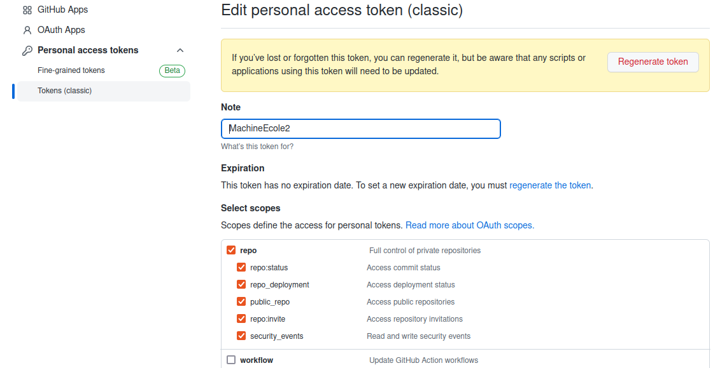
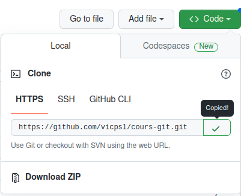

% Github

# 1. Ce qu'il manque jusque-là

- Capacité de sauvegarde distance : dois-je faire une copie dans ma dropbox ?
- Capacité de travailler en équipe : dois-je faire un git dans ma dropbox et partager le dossier ?
- etc.

 

<hr style="border:2px solid gray">

# 2. Git et ses services en ligne

Des entreprises et des structures du public fournissent des serveurs centralisés pour git :

- [Github](https://github.com), qui est le plus à la mode et que nous utiliserons
- [Gitlab](https://gitlab.com), qui est le concurrent le plus sérieux de github aujourd'hui
- [Bitbucket](https://bitbucket.org)

### Aller plus loin :
- Quelques éléments de comparaison :   
https://www.interviewbit.com/blog/bitbucket-vs-github/  
https://disbug.io/en/blog/github-vs-gitlab-vs-bitbucket

 

<hr style="border:2px solid gray">

# 3. Un dessin vaut mieux qu'une explication


 

<hr style="border:2px solid gray">

# 4. Le vocabulaire des serveurs distants pour Git

- *remote* : Serveur distant permettant la synchronisation manuelle de votre dépôt
- *origin* : Nom du serveur principal, un peu comme master est la branche principale. Pour l'instant, nos dépôts n'en ont pas
- *push* : Envoyez les modifications effectuées sur un serveur donné.
- *pull* : Synchroniser localement les informations depuis un serveur distant donné
- *clone* : Copie sur votre PC d'un dépôt en ligne
- *fork* : Dérivé d'un dépôt d'un-e autre développeur-se
- *upstream* : Par convention, nom d'un second serveur, généralement le serveur source du *fork*

 

<hr style="border:2px solid gray">

# 5. Créons un compte Github 

- Github a des défauts (pas open source par exemple) mais reste l'outil le plus moderne pour de la gestion de code versionné en équipe
- Github propose un environnement complet
	- Gestion d'équipe
	- Connexions à d'autres applications
	- Gestion de ticket
	- Gestion de fusion de branches
	- etc.

### L'authentification sur Github :

Vous pouvez accéder à vos ressources dans GitHub de différentes façons : dans le navigateur, avec GitHub Desktop ou une autre application de bureau, avec l’API ou par le biais de la ligne de commande. Chaque façon d’accéder à GitHub prend en charge différents modes d’authentification.

Outre la connection au compte Github en ligne, nous verrons ici la méthode d'identification pour collaborer via le terminal, grâce au **token**.

Vous pouvez créer un token :

- en suivant les instructions ci-dessous (Aller plus loin : voir la documentation)
- [Et/ou se rendre ici](https://github.com/settings/tokens) et créer un token.    
Si vous interagissez simplement avec des référentiels, vous souhaiterez probablement simplement sélectionner "repo" comme "portée" :  



### Aller plus loin (différents canaux d'identification, stockage des identifiants)

- [Voir la documentation complète](https://docs.github.com/fr/authentication/keeping-your-account-and-data-secure/creating-a-personal-access-token)
- [Documentation succincte (Department of Statistics de Berkeley University)](https://statistics.berkeley.edu/computing/faqs/git-auth)

 

<hr style="border:2px solid gray">

# 6. Créons un dépôt Github à partir d'un dépôt local

Documentation Github en ligne https://docs.github.com/en/get-started et https://docs.github.com/fr/get-started en Français.

1. Sur Github, créer un repo "notes-de-cours" (qui recevra notre dépôt local)
	- **/!\\ Surtout ne pas cocher initialiser le repository**
		- Pourquoi ?
2. Créer et initialiser un dépôt local "notes-de-cours" correspondant  
*En général un dossier/dépôt local avec du code existe déjà*
3. Ajouter le serveur Github à votre dépôt local
	- `git remote add origin [adresse du serveur distant GitHub]`
4. Pour le premier push de synchronisation
	- `git push -u origin master`
		- envoie (*push*) ma branche actuelle (*master* ou main) sur la branche *master* (ou main) du serveur Github, par convention *origin*. Cette branche correspondra à partir de maintenant à celle sur mon dépôt local
        - "-u:" le flag *-u* signifie "upstream", équivalent à '-set-upstream'
	- `git push` sera suffisant (pour la branche master !) à partir de maintenant.
    - Toute *nouvelle_branche* locale nécessitera `git push -u origin nouvelle_branche`

 

<hr style="border:2px solid gray">

# 7. Cloner un dépôt (*repository*)

### Intéractions avec un dépôt :

Un dépôt Git en ligne est peu ou prou la même chose qu'un dépôt local sauf que vous ne pouvez pas commit directement dessus. Il s'agit de l'archive ".git" de votre dépôt avec la capacité de se connecter et de synchroniser ces informations. 

- Tous les dépôts Git ne sont **pas disponible en écriture** :  
il se peut qu'un repository Git/Github distant soit protégé pour n'être modifié que par un groupe défini de personnes.


- Cependant, cela n'empêche pas de les **cloner** et de travailler dessus localement.  
Vous ne pourrez juste pas modifier le dépôt Git distant (remote) si vous n'avez pas accès en écriture.

### Cloner un dépôt :

- Se rendre sur le dépôt :

> [https://github.com/vicpsl/cours-git](https://github.com/vicpsl/cours-git)

- Copier son URL (mode https) :




- Dans le terminal du dossier d'accueil du dépôt local :


`git clone https://github.com/vicpsl/cours-git.git`

 

<hr style="border:2px solid gray">

# 8. Commandes utiles (statut et intéractions)

- `git remote -v` : répertorie vos connexions distantes avec d'autres dépôts, incluant leurs URLs
- `git remote show origin` ou `git remote show upstream` : sortie détaillée d'un dépôt distant, dont la liste des branches associées au dépôt distant et celles en local liées pour les pull et les push
- `git branch -r` : listes toutes les branches du dépôt distant
- `git branch -a` : lister toutes les branches
- `git pull` : mettre à jour immédiatement *la branche courante* du dépôt local (combinaison de git fetch et git merge)
- `git pull --all` : **/!\\** mettre à jour immédiatement *toutes les branches liées* du dépôt local
- `git push -u origin master` (voir 6) : **premier** push de synchronisation d'une branche locale vers le dépôt distant
- `git push` (voir 6) : push de synchronisation d'une branche locale vers le dépôt distant

 

<hr style="border:2px solid gray">


# 9. Le fichier .gitignore

### Tout n'a pas vocation à être diffusé en ligne / inclus dans un dépôt
Git c'est bien, mais on ne veut pas toujours mettre à disposition toutes ses sources. Par exemple, le fichier qui comprend les mots de passe des bases de données, des fichiers caches ou compilés, etc.

Git fournit bien évidemment un outil pour cela : le fichier `.gitignore`.  

Nous avons vu que certains fichiers peuvent poser problème (gros fichiers, images, fichiers xml sources volumineux, etc.) : de tels fichiers dans vos dépôts d'applications pourront être exclus du versioning des dépôts grâce au `.gitignore`. 

### Où stocker le `.gitignore`

- Ce fichier se nomme forcément `.gitignore` (Il commence donc par un point !).
- Il se trouve à la racine du dépôt par défaut mais vous pouvez spécifier plusieurs .gitignore qui auront toujours un effet sur le dossier courant et ses descendants.

### Syntaxe 

Voici un exemple de fichier .gitignore :

```gitignore
*.txt
dossier/
dossier2/*.jpg
motdepasse.csv
```


| Ligne | Effet |
| ------- | ------ |
| `*.txt` | Cette ligne permettra d'ignorer tous les fichiers textes où qu'ils soient |
| `dossier/` | Cette ligne ignorera l'ensemble du contenu de `dossier` et par extension, le dossier lui-même (Git ne conserve pas les dossiers vides) |
| `dossier2/*.jpg` | Cette ligne ignorera les *.jpg dans le dossier2. Par contre, si dossier2 a des enfants (dossier2/sousdossier1) et des jpg à l'intérieur, il seront versionnés |
| `motdepasse.csv` | Cet ligne permet d'ignorer le fichier motdepasse.csv dans le dossier principal |


### Aller plus loin 

- [*Ignoring Files*, Github](https://help.github.com/articles/ignoring-files/)
- [Répertoire d'exemples de gitignore répartis par langages, Github](https://github.com/github/gitignore)

 

<hr style="border:2px solid gray">

# 10. Bonnes pratiques...
  
 

... quand on travaille à plusieurs ou sur plusieurs postes avec un dépôt distant

- Toujours faire un `git status` en se connectant sur son dossier ou une vérification du status des branches adéquates
- Suivi d'un `git pull` si vous/un collègue avez travaillé dessus depuis un autre poste ou depuis votre PC
- Essayez le plus possible de ne pas travailler dans la branche **master** mais dans des branches focalisées sur un objectif dès que votre projet commence à grossir

 

---