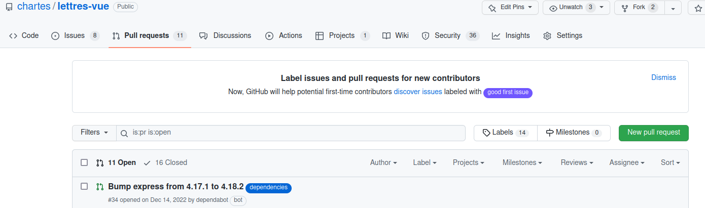

% La collaboration avec Github
---
marp: true
---

# 1. Github, gitlab, etc. : pourquoi ?

- Serveur distant
- Gestion d'équipe et de projets
	- Comptes utilisateurs
	- Comptes organisations
	- Équipes aux niveaux repository et organisations
- Gestion de bug et de tickets (Issues)
- Gestion de fusion de branche et de "review"

**NB :** pour suivre les événements relatifs à un dépôt, se rendre sur le repo Github et cliquer sur **Watch** en haut à droite.
Choisir les notifications souhaitées.

 

# 2. Github : les issues

- Un bug : on donne alors un titre au bug
	- si c'est dans le cadre d'un logiciel/d'une application/d'un site, on donne la démarche pour le reproduire 
	- on pense à donner les fichiers concernés par le bug
	- on essaye de décrire au mieux le problème. Même si c'est sur notre propre dépôt.
		- Sinon, on oublie le bug, on revient deux mois plus tard, on sait plus ce que c'est.

 

# 3. Github : les issues

- une nouveauté : on veut une nouvelle fonctionnalité, un nouvel ensemble de données
	- on décrit correctement ce que l'on veut, de manière à pouvoir transférer la charge ou s'en occuper soi-même plus tard
- une discussion : on essaye de comprendre un morceau de code, etc.

 

# 4. Github : les issues

- Les issues peuvent être **attribuées** à des membres du dépôt : si je travaille avec @vincentjolivet, et qu'un bug le concerne, je peux lui attribuer en tant que membre. Sinon, en voyant un bug qui me concerne, je peux me l'attribuer.
- Les issues peuvent avoir des **labels**. Une série de labels par défaut existe, mais on peut tout à fait en ajouter à ses propres dépôts.
- Les issues peuvent faire l'objet de regroupement dans des **projects** (sans deadline), des **milestones** (objectifs de sortie d'une nouvelle version).

**Github propose des modèles d'issues :**  
https://docs.github.com/fr/communities/using-templates-to-encourage-useful-issues-and-pull-requests/configuring-issue-templates-for-your-repository

 

# 5. Github : les issues d'un repo logiciel

 

# 6. Github : les issues d'un repo data

 

# 7. Github : un exemple de bonne issue

 

# 8. Github : un exemple de mauvaise issue

 

# 9. Les dépôts dérivés (forks)

- Les données de https://github.com/orgs/chartes/repositories?type=all vous intéresse. Mais vous aimeriez changer une partie des données : ne conserver que les testaments de poilu et supprimer les éléments qui ne correspondent pas à vos besoins.
- À ce moment-là, on va réaliser un **fork** du repository sur son propre compte. On obtient ainsi les droits d'écritures sur le repository tout en gardant l'ensemble de son historique. On travaille ensuite sur ce dépôt localement, comme on travaillerait avec n'importe quel dépôt.
- **Note:** Si l'on fait des modifications sur un dépôt d'une autre personne, il est plus respectueux de faire un fork que de télécharger et de créer un nouveau dépôt.

Pour réaliser un **fork**, se rendre sur le repo Github original et cliquer sur **fork** en haut à droite.

 

# 10. Collaborer : les *pull requests* ('PR')

- Une *pull request* (Vocabulaire de *github*) est une demande d'autorisation de contribution à un dépôt.
- Une pull request se fait entre deux branches, comme un merge. Cependant, cela peut être deux branches de deux forks.
- Contribuer à un repository ? 
	- Non seulement j'aide la personne et les utilisateurs du repository
	- Mais en plus j'apparais sur l'historique

A réaliser sur Github directement :
NB : lorsqu'une mise à jour a été soumise, des pull-requests sont créées (onglet **Pull requests**) avec leur id, ici : "#34".  
On peut également en créer directement sur Github (**New pull request**).

Dans une **Pull requests**, il y a 4 onglets :

- **Conversation** : les échanges relatifs à la pull request et ses éventuelles mises à jour successives
- **Commits** : la liste des commits inclus dans la pull request, ou l'on peut voir le code de chacun d'entre eux
- **Checks** : validations optionnelles sur le dépôt (https://docs.github.com/fr/pull-requests/collaborating-with-pull-requests/collaborating-on-repositories-with-code-quality-features/about-status-checks)
- **Files Changed** : une visualisation des ajouts, modifications et suppressions entre le code d'origine sur lequel on souhaite intégrer les changements et le code inclus dans la pull request.

NB : la PR indique s'il existe des conflits à résoudre ou si la mise à jour peut être automatiquement intégrée (*'This branch has no conflicts with the base branch'*).

 - Pour tester un code (d'une application, d'un site) avant de l'approuver :  
cliquer sur **command line instructions** en bas de la pull request : cela revient à créer dans votre dépôt local une branche (que l'on nomme comme on le souhaite) et d'y effectuer un pull depuis l'URL proposée.  
Par exemple :
 - `git checkout -b [ma_branche_test_PR34]`
 - `git pull [URL_de_la_branche_incluant_le_nouveau_code (ex: https://github.com/carinedengler/lettres-app.git)] 'id suggéré (ex: lettres-vue#25)'

Tester, tester , tester

- Si les mises à jour proposées sont satisfaisantes : cliquer sur **Merge pull request.**
- Sinon, ajouter un commentaire pour que vos interlocuteurs revoient leurs mises à jour et soumettent une nouvelle version.
- Si la pull request n'est pas ou plus pertinente, cliquer **Close pull request** (ferme la PR sans intégrer le nouveau code).

 

# 11. Collaborer : les *pull requests* (exemple de déroulé du processus)

-  Je remarque une erreur dans les métadonnées d'un document
	1. J'ouvre une issue qui explique le problème (Typo dans le fichier X, etc.)
	2. Parce que je veux être encore plus utile, je veux proposer la modification pour que le propriétaire n'ait pas à faire la correction lui-même
	3. Je fais un fork du dépôt du cours ( https://github.com/vicpsl/cours-git )
	4. Je crée une branche spécifique et je rentre dessus  
		Tip : quand on créé une branche pour un objectif particulier (issue), on référence l'issue pour se souvenir de la raison de la création de la branche
	5. Je fais la modification et je la commit
	6. Je push
	7. Je fais une pull request sur le dépôt d'origine

 

# 12. Exercice

- Aller sur https://github.com/vicpsl/cours-git-modifiable (lorsque l'enseignant vous aura donné accès)
- En suivant les bonnes pratiques (fork, issues, pull request) :  
Effectuer (modifier le slides.md de ce cours) et proposer la suppression d'une des lignes suivantes
  - ligne 1 à supprimer
  - ligne 2 à supprimer
  - ligne 3 à supprimer
  - ligne 4 à supprimer
  - ligne 5 à supprimer
  - ligne 6 à supprimer
  - ligne 7 à supprimer
  - ligne 8 à supprimer
  - ligne 9 à supprimer
  - ligne 10 à supprimer
  - ligne 11 à supprimer
  - ligne 12 à supprimer
  - ligne 13 à supprimer
  - ligne 14 à supprimer
  - ligne 15 à supprimer
  - ligne 16 à supprimer
  - ligne 17 à supprimer
  - ligne 18 à supprimer
  - ligne 20 à supprimer

 

